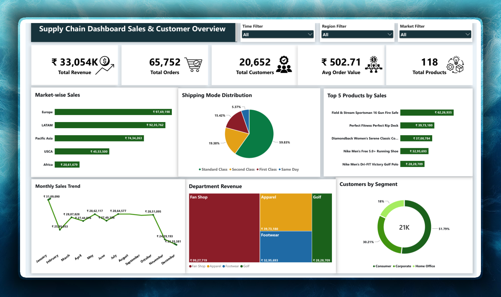
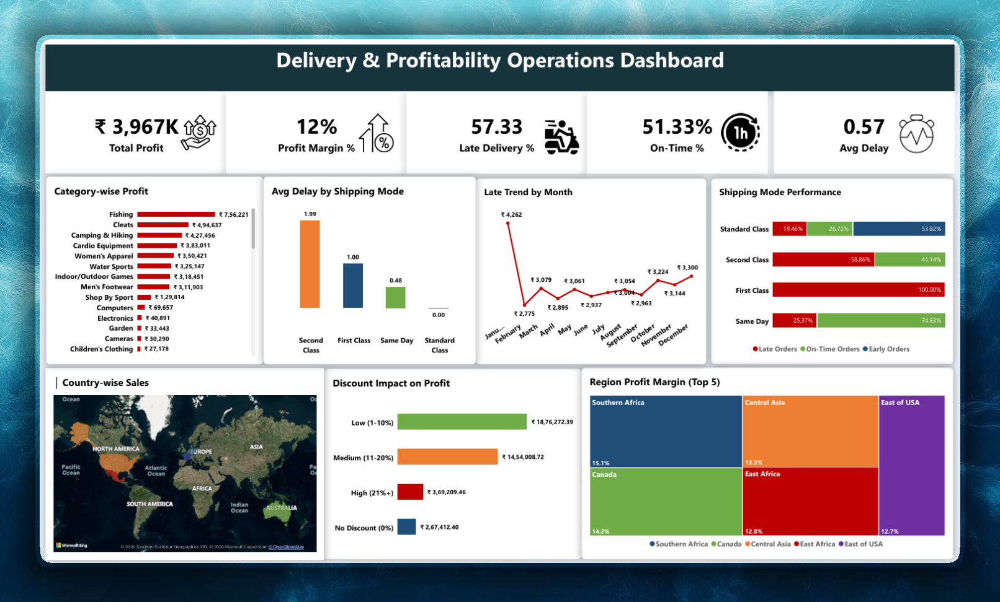

# Supply Chain & Delivery Analytics

End-to-end data analytics project using Excel, Power Query, PostgreSQL, and Power BI to analyze supply chain sales, profitability, and delivery operations.

---

## 🛠️ Tools Used

- **Excel** — Initial data exploration
- **Power Query** — Data transformation
- **PostgreSQL** — Data storage and analysis
- **Power BI** — Interactive dashboards

---

## 📊 Dashboard Preview

### Dashboard 1: Sales Performance

### Dashboard 2: Delivery & Profitability

---

## 📌 Project Workflow

1. **Data Transformation** — Cleaned and transformed data using Power Query
2. **SQL Analysis** — Analyzed data using PostgreSQL
3. **Power BI Dashboards** — Built 2 interactive dashboards

---

## 📈 SQL Analysis (PostgreSQL)

- Total revenue, orders, and customers
- Market-wise and region-wise sales
- Product category performance
- Delivery delays and shipping mode analysis
- Discount impact on profit
- Monthly sales trends

---

## 💡 Key Insights

### Delivery Performance
- Late delivery rate is high (57.33%)
- Second Class shipping has highest average delay (1.99 days)
- Discounts above 21% significantly reduce profit margins

### Sales Performance
- Europe is the top market (₹97.69L)
- Standard Class is the most used shipping mode (59.83%)
- Consumer segment dominates (51.79%)
- Fishing category generates highest profit (₹7.56L)

---

## 📁 Files

| File | Description |
|------|-------------|
| `README.md` | Project documentation |
| `Analysis_Queries.sql` | SQL analysis queries |
| `Dashboard_1_Sales.png` | Sales dashboard screenshot |
| `dashboard_2_delivery.png` | Delivery dashboard screenshot |
| `supply_chain_dashboard.pdf` | Complete dashboard PDF |

---

## 🛠️ Skills Demonstrated

- **SQL (PostgreSQL)** — Aggregations, GROUP BY, subqueries
- **Power BI** — Dashboard design, KPI cards, charts, maps
- **DAX** — Measures and calculated columns
- **Power Query** — Data transformation
- **Excel** — Data exploration
- **Business Insights** — Trend analysis, performance metrics

---

## 👤 Author

**Saklain Alam**  
Aspiring Data Analyst | SQL | Power BI | Python | Excel
